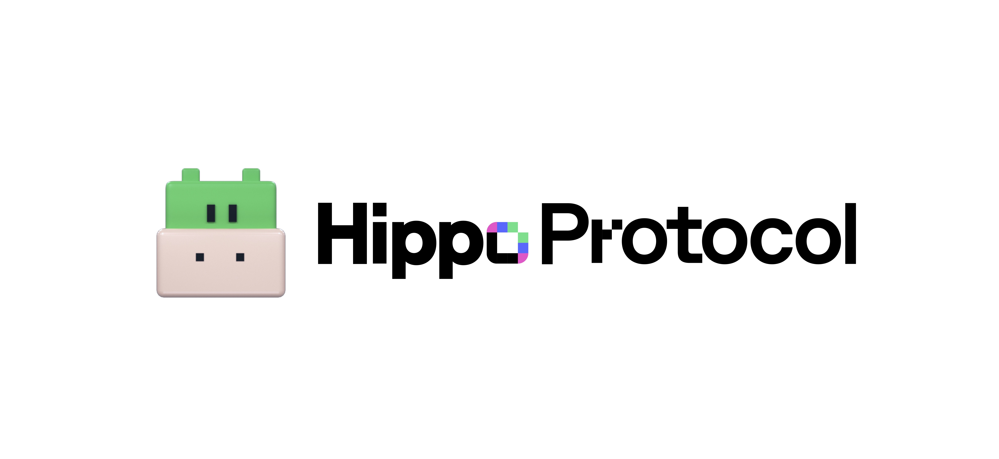

# Welcome to Hippo Protocol

`Hippo Protocol` is an application chain built using the Cosmos SDK for Healthcare Data Protocol.

For more detailed guide, please refer to [Hippo Protocol official document](https://docs.hippoprotocol.ai/).

## Getting Started

Please follow ["Getting Started"](https://docs.hippoprotocol.ai/main/getting-started) section of our official docs.

## Interacting with Hippod (CLI)

Please follow ["Interacting with Hippod (CLI)"](https://docs.hippoprotocol.ai/main/hub-tutorials/hippod) section of our official docs.

## Join the Hippo Protocol Mainnet

Please follow ["Join the Hippo Protocol Mainnet"](https://docs.hippoprotocol.ai/main/hub-tutorials/join-mainnet) section of our official docs.

## Running a Validator

Please follow ["Running a Validator"](https://docs.hippoprotocol.ai/main/validators/validator-setup) section of our official docs.
